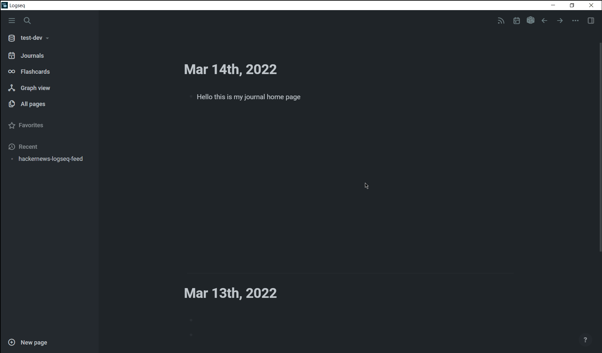

🚩WIP (Not stable yet)
# Logseq Hackernews Feed Plugin
Get the latest hackernews top stories inside Logseq.  
Just click on the icon on the top right tool bar. It opens a page called "hackernews-logseq-feed" where the latest 20 top stories are displayed.  

Note:  
When doing the above for the first time, if it returns a "page error" then simply manually create the hackernews-logseq-feed page and create one block inside the page. Then click on the icon on the top right tool bar.  


## Motivation
I open hackernews and logseq multiple times a day. Then why not combine them together. That was my thought process.  

## Development Setup
The project uses `pnpm` instead of `yarn` or `npm`.  
Install `pnpm` if you don't have it  
```bash
npm i -g pnpm
```

`cd` into the project root folder  
Then install the dependencies
```bash
pnpm install
```
To run the dev server
```bash
pnpm dev
```

To build 
```bash
pnpm build
```

NOTE:  
Reload the plugin after each change in code (For eg: when pnpm dev is running and you make a change in code and save it, you should reload the plugin)  
`t p` - shortcut to open the plugin page in logseq (saves you a few extra clicks)


  

Inspired by [logseq-reddit-hot-news](https://github.com/logseq/logseq-plugin-samples/tree/master/logseq-reddit-hot-news) 
